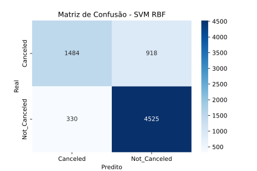
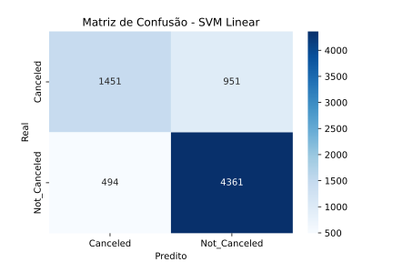

# Modelo de Machine Learning - SVM

Para esse projeto, foi utilizado um dataset obtido no [**Kaggle**](https://kaggle.com){:target='_blank'}.
Os dados usados podem ser baixados [**aqui**](https://www.kaggle.com/datasets/youssefaboelwafa/hotel-booking-cancellation-prediction/data){:target='_blank'}.
O dataset desse projeto é o mesmo do projeto do **KNN**. Por isso, as três primeiras etapas são muito semelhantes (nesse caso, vamos utilizar apenas o modelo 1 dos dois testados no outro projeto com essa base de dados).

## Objetivo

O dataset utilizado possui informações sobre reservas em um hotel, e foi criado justamente para a criação de modelos de machine learning com o objetivo de prever se um agendamento será, ou não, cancelado.

Os dados originais para a criação desse dataset foram obtidos em um artigo de dados, no site [**Science Direct**](https://www.sciencedirect.com/){:target='_blank'}. O [**artigo em questão**](https://www.sciencedirect.com/science/article/pii/S2352340918315191) foi escrito por *Nuno Antonio*, *Ana de Almeida* e *Luis Nunes*, e contém uma quantidade maior de dados do que a sua versão derivada do **Kaggle**, que estou utilizando para este projeto.

## Workflow

Os pontos *"etapas"* são o passo-a-passo da realização do projeto.

### Etapa 1 - Exploração de Dados

Primeiramente, deve ser feita a exploração dos dados da base, com o objetivo de compreender a forma como são estruturados os dados, sua natureza e possível significância para o modelo de predição.

O dataset é composto por **36285 linhas** e **17 colunas**, com cada linha representando uma reserva distinta. Essa verificação pôde ser feita com as linhas de código abaixo;

=== "Saída"

    ```python exec="1"
    --8<-- "docs/knn/exploring-knn.py"
    ```

=== "Código"

    ```python exec="0"
    --8<-- "docs/knn/exploring-knn.py"
    ```

#### Colunas do dataset

| Coluna | Tipo | Descrição |
|--------|------|-----------|
| Booking_ID | String | Identificador único da reserva |
| number of adults | Inteiro | Número de adultos presentes na reserva |
| number of children | Inteiro | Número de crianças presentes na reserva |
| number of weekend nights | Inteiro | Quantidade de noites em finais de semana reservadas |
| number of week nights | Inteiro | Quantidade de noites em dias de semana reservadas |
| type of meal | String | Plano de alimentação escolhido pelo cliente |
| car parking space | Inteiro | Variável binária que indica se um estacionamento de carro foi pedido ou incluso na reserva |
| room type | String | Tipo de quarto reservado |
| lead time | Inteiro | Número de dias entre a data da reserva e a data de chegada do cliente |
| market segment type | String | Tipo de segmento do mercado associado à reserva |
| repeated | Inteiro | Variável binária que indica se a reserva é, ou não, repetida |
| P-C | Inteiro | Número de reservas anteriores que foram canceladas pelo cliente antes do agendamento atual |
| P-not-C | Inteiro | Número de reservas anteriores que não foram canceladas pelo cliente antes do agendamento atual |
| average price | Float | Preço médio associado à reserva |
| special requests | Inteiro | Número de pedidos especiais feitos pelo convidado(a) |
| date of reservation | String | Data da reserva |
| booking status | String | Status da reserva (cancelada ou não cancelada) |

#### Visualizações das variáveis

Em seguida, é essencial realizar gráficos para visualizar como cada uma das variáveis se comportam, com o objetivo de entender melhor a base da dados.

Está seção será divida para cada tipo de variável, entre variáveis quantitativas discretas, quantitativas contínuas, qualitativas categóricas, binárias e, por fim, a variável alvo.

##### Variáveis Quantitativas Discretas

=== "number of adults"

    === "Gráfico"

        ``` python exec="1" html="1"
        --8<-- "docs/knn/visualizations/number_adults.py"
        ```

    === "Código"

        ``` python exec="0"
        --8<-- "docs/knn/visualizations/number_adults.py"
        ```

=== "number of children"

    === "Gráfico"

        ``` python exec="1" html="1"
        --8<-- "docs/knn/visualizations/number_children.py"
        ```

    === "Código"

        ``` python exec="0"
        --8<-- "docs/knn/visualizations/number_children.py"
        ```

=== "number of weekend nights"

    === "Gráfico"

        ``` python exec="1" html="1"
        --8<-- "docs/knn/visualizations/weekend_nights.py"
        ```

    === "Código"

        ``` python exec="0"
        --8<-- "docs/knn/visualizations/weekend_nights.py"
        ```

=== "number of week nights"

    === "Gráfico"

        ``` python exec="1" html="1"
        --8<-- "docs/knn/visualizations/week_nights.py"
        ```

    === "Código"

        ``` python exec="0"
        --8<-- "docs/knn/visualizations/week_nights.py"
        ```

=== "lead time"

    === "Gráfico"

        ``` python exec="1" html="1"
        --8<-- "docs/knn/visualizations/lead_time.py"
        ```

    === "Código"

        ``` python exec="0"
        --8<-- "docs/knn/visualizations/lead_time.py"
        ```

=== "P-C"

    === "Gráfico"

        ``` python exec="1" html="1"
        --8<-- "docs/knn/visualizations/p_c.py"
        ```

    === "Código"

        ``` python exec="0"
        --8<-- "docs/knn/visualizations/p_c.py"
        ```

=== "P-not-C"

    === "Gráfico"

        ``` python exec="1" html="1"
        --8<-- "docs/knn/visualizations/p_not_c.py"
        ```

    === "Código"

        ``` python exec="0"
        --8<-- "docs/knn/visualizations/p_not_c.py"
        ```

=== "special requests"

    === "Gráfico"

        ``` python exec="1" html="1"
        --8<-- "docs/knn/visualizations/special_requests.py"
        ```

    === "Código"

        ``` python exec="0"
        --8<-- "docs/knn/visualizations/special_requests.py"
        ```

##### Variável Quantitativa Contínua **`average price`**

=== "Gráfico"

    ``` python exec="1" html="1"
    --8<-- "docs/knn/visualizations/average_price.py"
    ```

=== "Código"

    ``` python exec="0"
    --8<-- "docs/knn/visualizations/average_price.py"
    ```

##### Variáveis Categóricas

=== "type of meal"

    === "Gráfico"

        ``` python exec="1" html="1"
        --8<-- "docs/knn/visualizations/type_meal.py"
        ```

    === "Código"

        ``` python exec="0"
        --8<-- "docs/knn/visualizations/type_meal.py"
        ```

=== "room type"

    === "Gráfico"

        ``` python exec="1" html="1"
        --8<-- "docs/knn/visualizations/type_room.py"
        ```

    === "Código"

        ``` python exec="0"
        --8<-- "docs/knn/visualizations/type_room.py"
        ```

=== "market segment type"

    === "Gráfico"

        ``` python exec="1" html="1"
        --8<-- "docs/knn/visualizations/type_market.py"
        ```

    === "Código"

        ``` python exec="0"
        --8<-- "docs/knn/visualizations/type_market.py"
        ```

##### Variáveis Binárias

=== "car parking space"

    === "Gráfico"

        ``` python exec="1" html="1"
        --8<-- "docs/knn/visualizations/car_parking.py"
        ```

    === "Código"

        ``` python exec="0"
        --8<-- "docs/knn/visualizations/car_parking.py"
        ```

=== "repeated"

    === "Gráfico"

        ``` python exec="1" html="1"
        --8<-- "docs/knn/visualizations/repeated.py"
        ```

    === "Código"

        ``` python exec="0"
        --8<-- "docs/knn/visualizations/repeated.py"
        ```

##### Variável Alvo **`booking status`**

=== "Gráfico"

    ``` python exec="1" html="1"
    --8<-- "docs/knn/visualizations/booking_status.py"
    ```

=== "Código"

    ``` python exec="0"
    --8<-- "docs/knn/visualizations/booking_status.py"
    ```

Através das análises, foi possível alcançar uma compreensão mais aprofundada do funcionamento de cada uma das variáveis no dataset, além de haver insights valiosos nesses gráficos. Esses dados serão essenciais para a escolha das variáveis que serão utilizadas no modelo.

### Etapa 2 - Pré-processamento 

Diferentemente do projeto do **KNN**, aqui, iremos aplicar apenas um dos modelos, aquele que foi ensinado em aula. Ou seja, primeiro vem o pré-processamento completo e, depois,
a divisão dos dados.

#### 1° Passo: Identificação e tratamento de valores nulos

O primeiro passo para o pré-processamento é identificar e tratar valores nulos na base.

``` python exec="0"
print(df.isna().sum())
```

Executando a linha de código acima para o dataframe contendo os dados da base, foi possível identificar que não há valores nulos na base.

#### 2° Passo: Remoção de colunas desimportantes

Em seguida, colunas que não são importantes para a predição serão removidas do dataframe. Essas colunas são `Booking_ID` e `date of reservation`. A forma que essa exclusão foi feita está representada abaixo:

``` python
df = df.drop(columns=["Booking_ID", "date of reservation"])
```

#### 3° Passo: Codificação de variáveis categóricas

O terceiro passo se consiste na codificação das variáveis categóricas. Essas são: `type of meal`, `room type` e `market segment type`.
Utilizaremos a técnica de One-Hot Encoding para codificar essas variáveis, utilizando o *OneHotEncoder()* do `scikit-learn`.

``` python exec="0"

from sklearn.preprocessing import OneHotEncoder

encoder = OneHotEncoder()
categorical_cols = ["type of meal", "room type", "market segment type"]

X = df.drop("booking status", axis=1)

X_encoded = encoder.fit_transform(X[categorical_cols])
encoded_df = pd.DataFrame(X_encoded.toarray(), columns=encoder.get_feature_names_out(categorical_cols), index=X.index)

X = pd.concat([X.drop(columns=categorical_cols), encoded_df], axis=1)

```

#### 4° Passo: Padronização das features numéricas 

Em seguida, é necessária a padronização das features numéricas na base. Ao invés da normalização, será utilizada a técnica de padronização devido aos outliers nas features numéricas, principalmente as variáveis `lead time` e `average price`, que desbalanceariam o cálculo de distâncias se apenas normalizadas.
Para a padronização, utilizaremos o *StandardScaler()* do `scikit-learn`.

``` python exec="0"

from sklearn.preprocessing import StandardScaler

scaler = StandardScaler()
numeric_cols = ["number of adults", "number of children", "number of weekend nights", 
                "number of week nights", "lead time", "P-C", "P-not-C", 
                "average price", "special requests"]

X = df.drop("booking status", axis=1)

X_scaled = scaler.fit_transform(X[numeric_cols])
scaled_df = pd.DataFrame(X_scaled, columns=numeric_cols, index=X.index)

X = pd.concat([X.drop(columns=numeric_cols), scaled_df], axis=1)

```

#### 5° Passo: Codificação da variável alvo

Por fim, vamos codificar a variável alvo `booking status` utilizando a técnica de label encoding. Ou seja, após esse passo, "Not_Canceled" vai assumir o valor 1 e "Canceled" o valor 0. Aqui, essa técnica pode ser utilizada, pois essa é a variável alvo, e não será utilizada no cálculo das distâncias. Para codificar, utilizaremos o *LabelEncoder()* do `scikit-learn`.

``` python exec="0"

from sklearn.preprocessing import LabelEncoder

l_encoder = LabelEncoder()
y = l_encoder.fit_transform(df["booking status"])

```

### Etapa 3 - Divisão dos dados

Como explicado anteriormente, essa etapa será realizada em momentos distintos dependendo do modelo utilizado. No primeiro modelo, esta etapa vem depois de todo o pré-processamento. No segundo modelo, esta etapa vem antes do pré-processamento.

- **Conjunto de Treino:** Utilizado para ensinar o modelo a reconhecer padrões

- **Conjunto de Teste:** Utilizado para avaliar o desempenho do modelo com dados ainda não vistos

Para realizar a divisão, foi utilizada a função *train_test_split()* do `scikit-learn`. Os parâmetros utilizados são:

- **test_size=0.2:** Define que 20% dos dados serão utilizados para teste, enquanto o restante será usado para treino.

- **random_state=42:** Parâmetro que controla o gerador de número aleatórios utilizado para sortear os dados antes de separá-los. Garante reprodutibilidade.

- **stratify=y:** Esse atributo definido como *y* é essencial devido à natureza da coluna `booking status`. Com essa definição, será mantida a mesma proporção das categorias em ambos os conjuntos, reduzindo o viés.

=== "Saída"

    ```python exec="1"
    --8<-- "docs/knn/division.py"
    ```

=== "Código"

    ```python exec="0"
    --8<-- "docs/knn/division.py"
    ```

Esta divisão adequada é de extrema importância, pois ajuda a evitar *overfitting*.

### Etapa 4 - Treinamento do Modelo

Para o treinamento do modelo, obviamente, utilizaremos a técnica de **SVM (Support Vector Machines)**. Contudo, temos que definir uma solução de SVM para nossa base: um kernel linear, aplicado utilizando o **LinearSVC**, ou um kernel não-linear, a **RBF (Radial Basis Function)**. O dataset é grande, e possui aproximadamente 37 mil amostras. 

A **RBF** possui complexidade algorítmica de **O(n²)** e demanda cálculos intensivos no espaço transformado para determinar o hiperplano de separação com um *SVC (Support Vector Classifier)*, enquanto a solução linear possui muito mais velocidade, é projetada para lidar com datasets grandes e possui complexidade quase linear em relação ao número de amostras. 

Ou seja, **RBF** é bem mais lento e exige mais memória, porém pode se sair melhor. Além disso, kernels não-lineares tendem ao *overfitting*. Então, vamos testar ambos kernels. Para compará-los, vamos obter suas métricas de avaliação e aplicar *cross-validation*.

=== "Modelo utilizando **RBF**"

    === "Saída"

        ```python exec="1"
        --8<-- "docs/svm/training-rbf.py"
        ```

    === "Código"

        ```python exec="0"
        --8<-- "docs/svm/training-rbf.py"
        ```

=== "Modelo utilizando solução **linear**"

    === "Saída"

        ```python exec="1"
        --8<-- "docs/svm/training-linear.py"
        ```

    === "Código"

        ```python exec="0"
        --8<-- "docs/svm/training-linear.py"
        ```

### Etapa 5 - Avaliação dos Modelos

Agora, vamos avaliar os modelos para definir qual será mantido. Primeiramente, vamos obter as matrizes de confusão.

#### Matrizes de Confusão

##### Modelo RBF

=== "Matriz de confusão - Modelo RBF"

    

=== "Código"

    ```python exec="0"
    --8<-- "docs/svm/cm-rbf.py"
    ```

##### Modelo Linear

=== "Matriz de confusão - Modelo Linear"

    

=== "Código"

    ```python exec="0"
    --8<-- "docs/svm/cm-linear.py"
    ```

Como é possível observar na saída dos treinamentos, o modelo **RBF** obteve acurácia de **0.828**, enquanto o modelo linear obteve acurácia de **0.80**. Para um dataset como esse, é uma diferença significativa.

Além disso, todas as outras métricas, como recall e precisão, também foram maiores no modelo **RBF**. Ou seja, tanto para casos positivos quanto para casos negativos, o modelo utilizando o kernel **RBF** se saiu melhor, com menos falsos positivos, menos falsos negativos, mais verdadeiros positivos e mais verdadeiros negativos, como é possível observar nas matrizes de confusão.

Contudo, antes de darmos qualquer tipo de certeza, vamos aplicar uma validação cruzada para checar a estabilidade dos modelos.

#### Validação Cruzada

=== "Saída"

    ```python exec="1"
    --8<-- "docs/svm/cross-val.py"
    ```

=== "Código"

    ```python exec="0"
    --8<-- "docs/svm/cross-val.py"
    ```

Apesar da maior complexidade computacional do kernel **RBF**, a validação cruzada mostrou que ele apresenta desempenho consistentemente superior ao **LinearSVC**.
O **RBF** obteve média de acurácia de *82,98%*, contra *79,89%* do **modelo linear**, com baixa variabilidade entre os folds e sem sinais de *overfitting*.

### Etapa 6 - Relatório Final

#### Comparação Final dos Modelos

##### SVM com Kernel RBF (SVC)

- Realiza transformação não-linear dos dados.

- Captura relações complexas presentes no dataset.

*Contudo, apresenta:*

- Alto custo computacional (complexidade **O(n²)**),

- Maior tempo de treinamento.

- Menor escalabilidade para bases muito grandes.

##### SVM Linear (LinearSVC)

- Consideravelmente mais rápido e escalável.

- Adequado para datasets extensos, especialmente após one-hot encoding.

- Complexidade quase linear.

- Desempenho competitivo, embora inferior ao RBF neste estudo específico.

##### Escolha Final de Modelo

Como este trabalho tem caráter experimental e prioriza desempenho preditivo em vez de custo computacional, o **modelo SVM com kernel RBF** será mantido como escolha final. Ele apresentou aproximadamente 3% de acurácia a mais que o LinearSVC e se mostrou estável durante a validação cruzada.

Entretanto, em aplicações reais de negócio, onde **tempo de treinamento**, **custo computacional** e **escalabilidade** são *fatores críticos*, esse ganho de performance pode não justificar o custo. Nesses cenários, o **SVM Linear** se torna a opção mais apropriada.